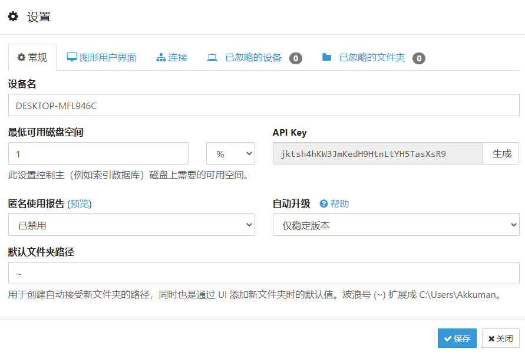
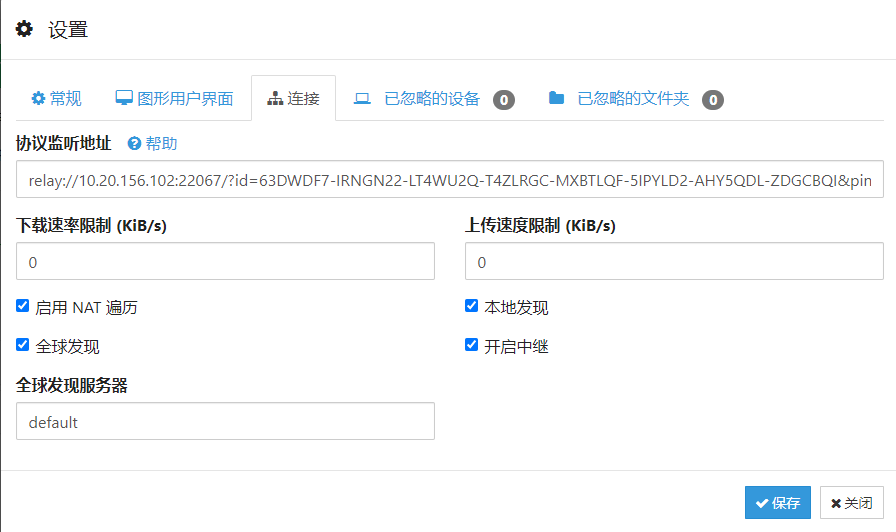
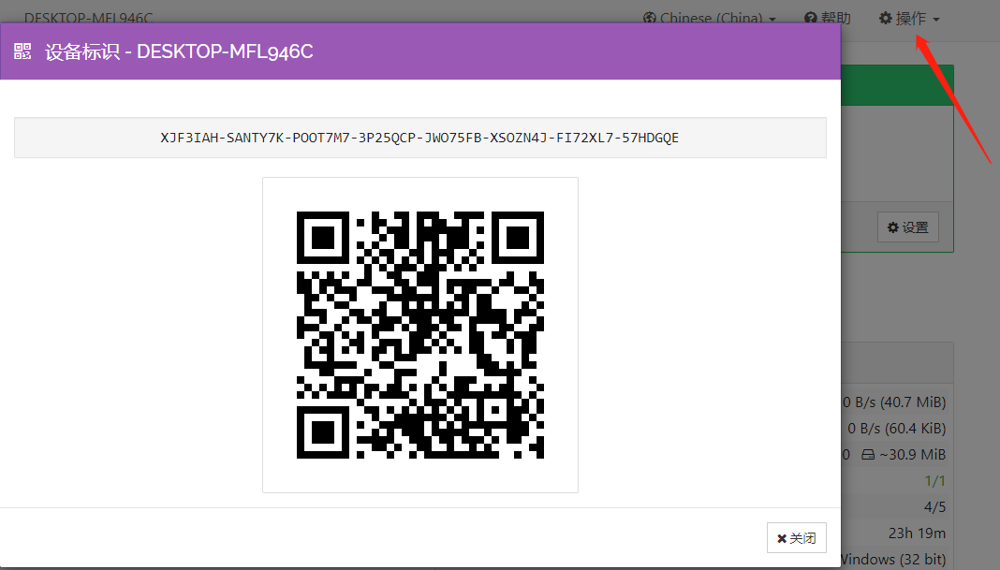
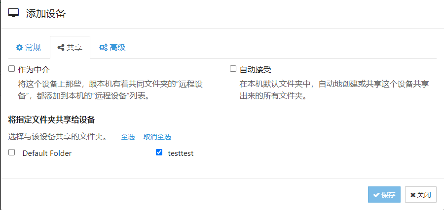
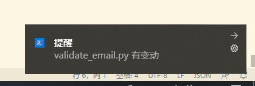
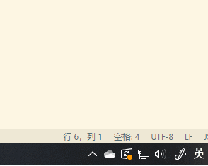

# syncthing-notify

根据 syncthing 提供的 REST API 进行消息处理与桌面通知

## Feature

- darwin, linux, windows 均支持桌面通知
- windows 支持托盘闪烁通知

## 中继服务器搭建

syncthing 是基于 p2p 的，一般来说开箱即用，但是真正的 p2p 往往在国内 nat 复杂的网络环境下根本无法连通（参见 DHT）

导致一个情况就是需要借助 syncthing 官方的节点发现服务器进行节点发现，并且在双方无法连通的情况下进行流量中转传输

所以为了速度考虑，建议搭建一个中继服务器

1. 在 [relaysrv](https://github.com/syncthing/relaysrv/releases) 下载最新的中继服务器客户端
2. 解压运行 `strelaysrv -pools=""`
3. 记录下中继服务器地址，类似 `relay://10.20.156.102:22067/?id=63DWDF7-IRNGN22-LT4WU2Q-T4ZLRGC-MXBTLQF-5IPYLD2-AHY5QDL-ZDGCBQI&pingInterval=1m0s&networkTimeout=2m0s&sessionLimitBps=0&globalLimitBps=0&statusAddr=:22070&providedBy=`

**注意**：其中的 `-pools=""`，不然你的中继服务器有可能变成肉便器，这个参数的含义是加入到哪些中继节点池，默认为 `http://relays.syncthing.net/endpoint`，不进行设置的话会把你的服务器广播出去，大家就都知道你的中继服务器然后来使用了

## syncthing 简易使用

首先去 [syncthing](https://github.com/syncthing/syncthing/releases) 下载合适的版本

解压运行，会自动打开浏览器，删除上面的 `Default Folder`，然后新建一个合适的共享文件夹

点击右上角设置，记录下其中的 **apikey**



然后点击连接，把刚才的中继服务器地址填入



接着记录下本机的**设备 id**



**设备 id** 就是这串 `XJF3IAH-SANTY7K-POOT7M7-3P25QCP-JWO75FB-XSOZN4J-FI72XL7-57HDGQE`，分享给对方，对方电脑上也是按照刚才的步骤进行 syncthing 的安装与使用

获取到对方的设备 id 后，点击右下角的添加远程设备，然后共享里面勾选上你刚才选择的文件夹



然后保存进行连接即可

过一会对方电脑上会出现连接请求


接受即可

以及文件夹共享请求也接受


记得同时勾选下方的共享给对方，这样两边的文件夹即可进行同步了


## syncthing 与本程序的桌面通知联动

如果你没有进行更改，那么 syncthing web默认监听的地址应该是 `http://127.0.0.1:8384/`，如果有变更，请在本程序命令行参数中设置

```bash
Usage of notify.exe:
  -address string
        syncthing web gui address (default "http://127.0.0.1:8384")
  -apikey string
        syncthing api key
  -notify
        whether to give notice
  -title string
        notify title (default "提醒")

```

其中：

- address 为 syncthing 监听的 web 界面地址，一般不用手动设定
- apikey 为我们刚才记下的 apikey，这个是必要的
- notify 是否进行桌面提醒，默认不提醒
- title 桌面提醒标题，一般不需要设定

使用样例

```bash
notify.exe -apikey jktsh4hKW3JmKedH9HtnLtYH5TasXsR9 -notify
```

运行之后会在此文件夹下生成一个配置文件 `config.json`，可根据自己的需求进行更改

### 桌面提醒



每当有新文件更新完毕便会出现弹窗提醒

### 托盘闪烁

windows 上支持托盘闪烁的功能



每当有新文件更新完毕便会开始闪烁，然后点击会出现此段时间内更新的文件项，同时托盘闪烁会停止，菜单最顶上的 Exit 是退出程序

当你点击更新的文件项时，下次点击时该文件项会从菜单中删除掉